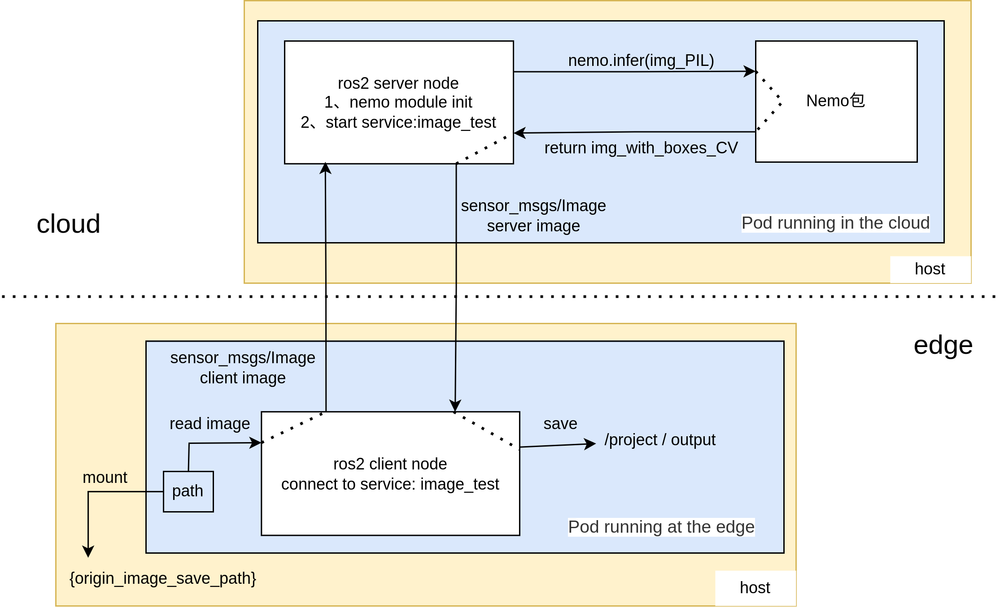
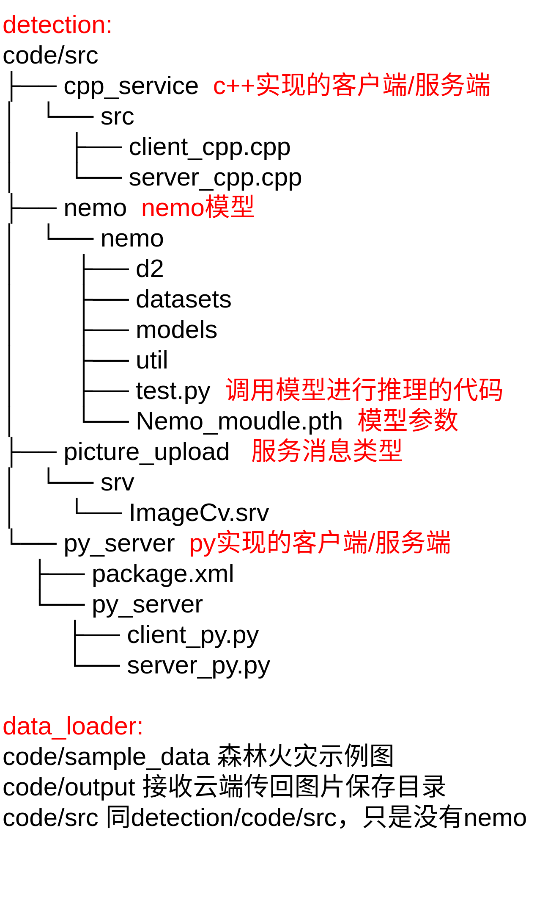

# Wildfire Smoke Detection

## Description 

This demo contains two general modules: Cloud detection module and a edge data loader.
The overall structure is shown in the following figure.


### Running in Kubeedge
先把Nemo_moudle.pth放进detection/code/src/nemo/nemo目录下，文件太大传不上
An example:
1. build the detection image and loader image
``` 
docker build -t data_loader .

docker build -t detection .
```  
2. pack the images and upload them to containerd
```
docker save {your_image_name} -o {your_save_path}
ctr -n k8s.io image import {your_save_path}
```
3. run in kubeedge
You need to make some changes to the ros2-picture-load.yaml based on actual conditions, such as specifying the running node and the image name.
```
sudo kubectl apply -f ros2-picture-load.yaml
```
4. check
It may take a while to successfully run. Use command below to check.
``` 
sudo kubectl logs {your_pod_name}
```
If message like "Proccessing ... in 0.833s" comes up in the server node, it means nemo module has completed testing an image.
If message like "成功保存图片" comes up in the client node, it means it has successfully received a detected image from cloud node and save in the path /project/ouput. You can copy it to your host path using command below:
```
kubectl cp {your_client_pod_name}:/project/output/result.png {your_host_path}
```
Then you can open the image to check.

A demo:
https://github.com/user-attachments/assets/f034029f-2c5c-479c-8978-ef362edf4139
https://private-user-images.githubusercontent.com/110225765/355741976-f034029f-2c5c-479c-8978-ef362edf4139.mp4

### About the code 

The folder structure is shown in the following figure.


### Debugging
如果出现问题需要进入pod进行调试，先把.yaml文件中将两个pod中的
```
args: 
        - "source /opt/ros/$ROS_DISTRO/setup.bash && \
           cd /project && source install/setup.bash && \
           ros2 run py_server server_py && \
           tail -f /dev/null"
```
替换为
```
args: 
        - "source /opt/ros/$ROS_DISTRO/setup.bash && \
           ros2 topic echo /chatter_1 std_msgs/String"
```
保证pod能正常运行。然后用以下命令进入pod：
```
sudo kubectl exec  --stdin --tty {your_pod_name}  -- /bin/bash
source /opt/ros/rolling/setup.bash 
source install/setup.bash
ros2 run ros2 run py_server server_py // 启动服务端（云端）
ros2 run cpp_service client_cpp // 启动客户端（边端）
```
**更改代码：**
```
vim /project/src/py_server/py_server/server_py.py //服务端代码
vim /project/src/cpp_service/src/client_cpp.cpp // 客户端代码
vim /project/src/py_server/nemo/nemo/test.py // 模型推理相关代码

cd /project && colcon build
ros2 run xxx
```
## Note
示例实现的效果：client将pod内的一张图片传送至server，server将该图片经过nemo推理后绘制检测结果并传回给client，client保存到/project/output目录下。
之前未加入模型推理时已成功实现挂载本机路径，从本机路径中读取图片传送到云端。如需实现从挂载本机路径中读取，可将ros2-picture-load.yaml中以下注释取消并更改：
```
        #volumeMounts:
        #- name: host-volume
          #mountPath: /image # 容器内的挂载路径(根据代码修改)
      #volumes:
      #- name: host-volume
        #hostPath:
          #path: /home/lizi/image # 主机上的挂载路径（改为所运行节点主机实际存储图片的路径）
```
客户端代码src/client_cpp.cpp中对以下位置进行更改：
```
 cv::Mat img = cv::imread("{容器内的挂载路径}/{图片名称}", 1);
 ```


